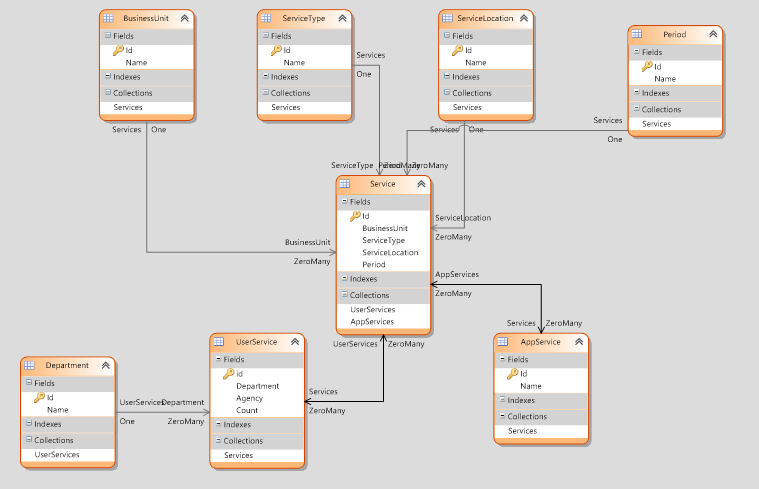

# acme-devexpress

This project was development under [this specifications](./assets/test.pdf) as part of recruitment process in Cosim Ti.

### Dependencies
Dev express  15.2.7 Build 20160304

### Configuration
Change the string connection in Web Config file.

### Tutorials
[Creating an ASP.NET Blog Engine with DevExpress- Part 1](https://www.youtube.com/watch?v=AMIIPI9XWjc)
[¿Qué tan rápido es el desarrollo en XAF?](https://www.youtube.com/watch?v=RfevAkFxa5Q)
[XAF: Create an Application Based on an Existing XPO Database](https://www.youtube.com/watch?v=vw5ZnJ-9Iyw)
